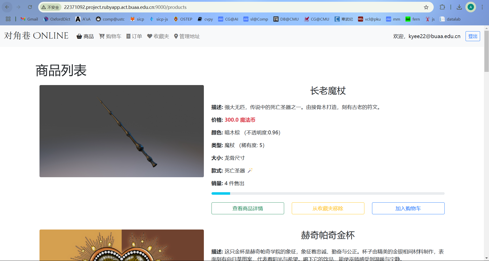
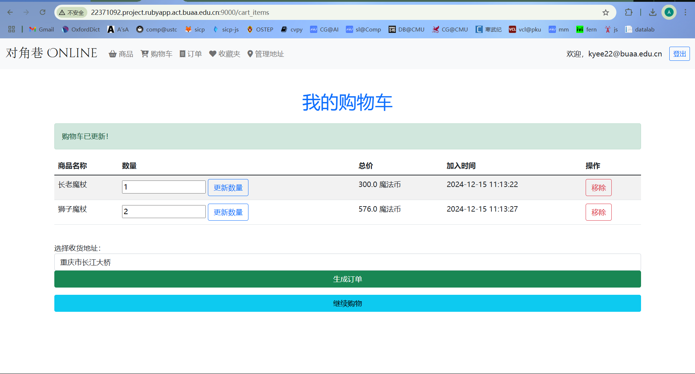
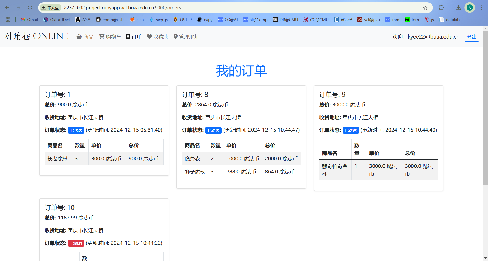
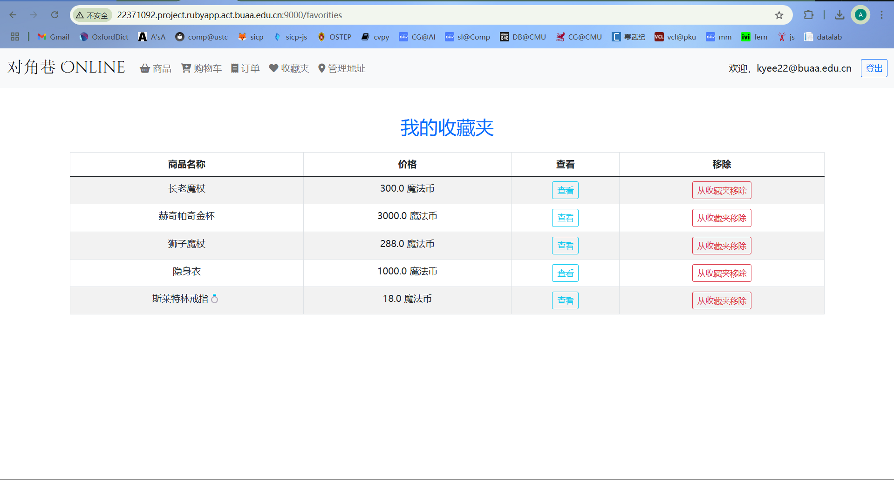
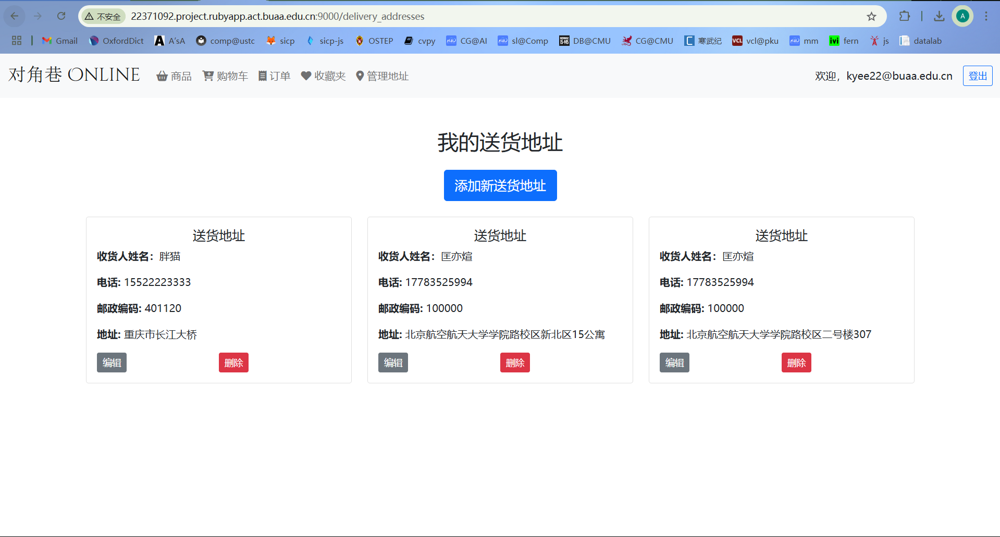
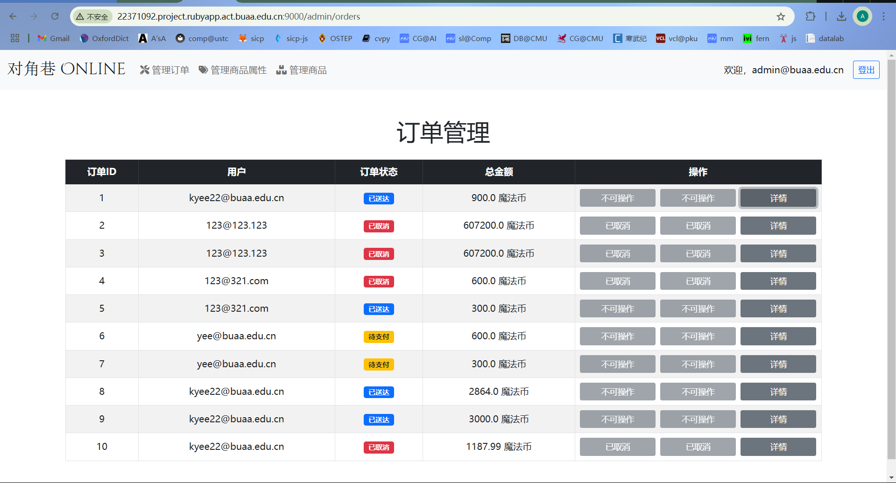
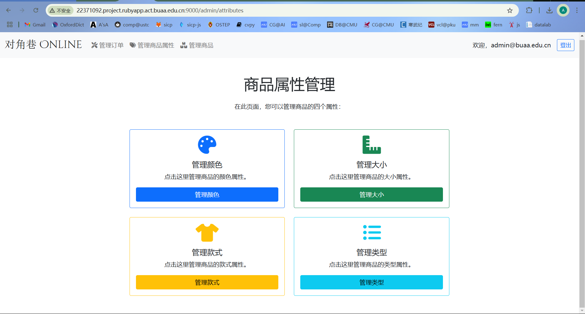
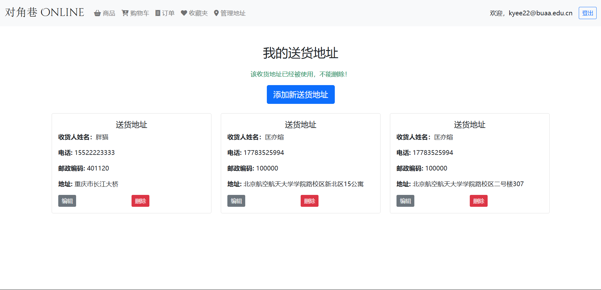
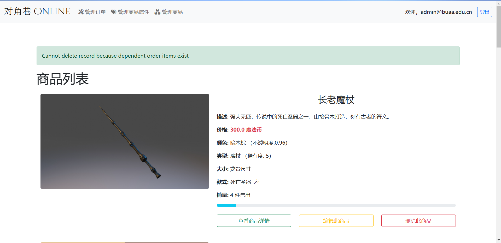

# 对角巷 Online 🧙‍♂️✨🛒

>   Ruby on Rails 敏捷开发大作业
>
>   *   匡亦煊（$22371092$，计算机学院）
>   *   选做题目：**`简易电子商务系统`**


欢迎来到**对角巷 Online**——一个充满魔法与奇幻的电子商务系统！灵感来自《哈利·波特》中的对角巷，我们在这里为你呈现了一个融合了魔法元素的购物体验。用户可以在魔法世界中购买魔法用品、魔杖、飞天扫帚等商品，而管理员则像霍格沃茨的商会管理员一样，负责管理魔法物品的库存、处理订单等事务。

通过 Ruby on Rails 开发，打造一个魔法世界里的电子商务系统，提供一系列面向用户和管理员的功能：

-   **买家**可以在魔法市场中浏览和购买魔法物品、管理购物车与订单、收藏魔法物品。
-   **管理员**如同魔法商店的老板，负责管理魔法物品、查看和处理订单。

## 第零部分：开发和运行环境

*   OS: `Linux 发行版 Ubuntu 22.04.4 LTS`
*   IDE: `RubyMine 2024.2.1`
*   Ruby: `ruby 3.3.5 (2024-09-03 revision ef084cc8f4) [x86_64-linux]`
*   Rails: `Rails 7.2.2`

## 第一部分：需求分析

>   TODO：
>
>   *   买家操作
>       -   [x] 浏览产品列表 =>  查看单品详情
>       -   [x] 添加到购物车
>       -   [x] 购物车内容生成订单
>       -   [x] 查看自己的订单列表
>       -   [x] 订单操作（付款，确认收货，取消订单）
>       -   [x] 添加产品到收藏夹
>       -   [x] 浏览收藏夹
>       -   [x] 将产品从收藏夹内删除
>   *   管理员操作
>       -   [x] 添加/编辑/查看/删除产品
>       -   [x] 查看所有订单列表
>       -   [x] 处理订单（发货/删除）

## 第二部分：功能实现

### 概念模型

省略了关系名称的概念模型图如下所示



### 实现思路

可以发现对象之间的关系比较复杂，于是在实现的时候要将其分而治之。注意到图中的对象可以分为以**用户**为中心以及以**产品**为中心 $2$ 大部分。实现思路

1.   实现以产品为中心的部分：`产品`、`颜色`、`类型`、`大小` 和 `款式`，不难发现这与 `Blog4` 项目中 `recipe` 和 `category` 的关系如出一辙；
2.   实现以用户为中心的部分：`用户` 和 `收货地址`，利用 devise 插件可以快速构建用户管理的基础设施，从而避免重复造轮子，并区分出 `user` 和 `admin` $2$ 种 `role`；
3.   最后将 $2$ 大部分“连接”起来，实现其中的 `订单`，`订单项`、`购物车` 和 `收藏夹`。

### 数据模型

以上关系图对应的数据模式如下所示

```ruby
ActiveRecord::Schema[7.2].define(version: 2024_12_14_070303) do
  create_table "active_storage_attachments", force: :cascade do |t|
    t.string "name", null: false
    t.string "record_type", null: false
    t.bigint "record_id", null: false
    t.bigint "blob_id", null: false
    t.datetime "created_at", null: false
    t.index ["blob_id"], name: "index_active_storage_attachments_on_blob_id"
    t.index ["record_type", "record_id", "name", "blob_id"], name: "index_active_storage_attachments_uniqueness", unique: true
  end

  create_table "active_storage_blobs", force: :cascade do |t|
    t.string "key", null: false
    t.string "filename", null: false
    t.string "content_type"
    t.text "metadata"
    t.string "service_name", null: false
    t.bigint "byte_size", null: false
    t.string "checksum"
    t.datetime "created_at", null: false
    t.index ["key"], name: "index_active_storage_blobs_on_key", unique: true
  end

  create_table "active_storage_variant_records", force: :cascade do |t|
    t.bigint "blob_id", null: false
    t.string "variation_digest", null: false
    t.index ["blob_id", "variation_digest"], name: "index_active_storage_variant_records_uniqueness", unique: true
  end

  create_table "cart_items", force: :cascade do |t|
    t.integer "user_id", null: false
    t.integer "product_id", null: false
    t.integer "quantity"
    t.datetime "added_at"
    t.datetime "created_at", null: false
    t.datetime "updated_at", null: false
    t.index ["product_id"], name: "index_cart_items_on_product_id"
    t.index ["user_id"], name: "index_cart_items_on_user_id"
  end

  create_table "colors", force: :cascade do |t|
    t.string "name"
    t.string "code"
    t.decimal "opacity"
    t.datetime "created_at", null: false
    t.datetime "updated_at", null: false
  end

  create_table "delivery_addresses", force: :cascade do |t|
    t.integer "user_id", null: false
    t.string "phone"
    t.string "postal_code"
    t.text "address"
    t.datetime "created_at", null: false
    t.datetime "updated_at", null: false
    t.string "receiver_name"
    t.index ["user_id"], name: "index_delivery_addresses_on_user_id"
  end

  create_table "designs", force: :cascade do |t|
    t.string "name"
    t.datetime "created_at", null: false
    t.datetime "updated_at", null: false
  end

  create_table "favorites", force: :cascade do |t|
    t.integer "user_id", null: false
    t.integer "product_id", null: false
    t.datetime "created_at", null: false
    t.datetime "updated_at", null: false
    t.index ["product_id"], name: "index_favorites_on_product_id"
    t.index ["user_id"], name: "index_favorites_on_user_id"
  end

  create_table "order_items", force: :cascade do |t|
    t.integer "order_id", null: false
    t.integer "product_id", null: false
    t.integer "quantity"
    t.decimal "price"
    t.datetime "created_at", null: false
    t.datetime "updated_at", null: false
    t.index ["order_id"], name: "index_order_items_on_order_id"
    t.index ["product_id"], name: "index_order_items_on_product_id"
  end

  create_table "orders", force: :cascade do |t|
    t.integer "user_id", null: false
    t.integer "delivery_address_id", null: false
    t.decimal "total_price", precision: 10, scale: 2, default: "0.0", null: false
    t.integer "status", default: 0, null: false
    t.datetime "created_at", null: false
    t.datetime "updated_at", null: false
    t.index ["delivery_address_id"], name: "index_orders_on_delivery_address_id"
    t.index ["user_id"], name: "index_orders_on_user_id"
  end

  create_table "products", force: :cascade do |t|
    t.string "name"
    t.text "description"
    t.decimal "price"
    t.integer "sales", default: 0
    t.datetime "created_at", null: false
    t.datetime "updated_at", null: false
    t.integer "color_id", null: false
    t.integer "type_id", null: false
    t.integer "size_id", null: false
    t.integer "design_id", null: false
    t.index ["color_id"], name: "index_products_on_color_id"
    t.index ["design_id"], name: "index_products_on_design_id"
    t.index ["size_id"], name: "index_products_on_size_id"
    t.index ["type_id"], name: "index_products_on_type_id"
  end

  create_table "sizes", force: :cascade do |t|
    t.string "name"
    t.datetime "created_at", null: false
    t.datetime "updated_at", null: false
  end

  create_table "types", force: :cascade do |t|
    t.string "name"
    t.integer "rarity"
    t.datetime "created_at", null: false
    t.datetime "updated_at", null: false
  end

  create_table "users", force: :cascade do |t|
    t.string "email", default: "", null: false
    t.string "encrypted_password", default: "", null: false
    t.string "reset_password_token"
    t.datetime "reset_password_sent_at"
    t.datetime "remember_created_at"
    t.datetime "created_at", null: false
    t.datetime "updated_at", null: false
    t.string "role"
    t.index ["email"], name: "index_users_on_email", unique: true
    t.index ["reset_password_token"], name: "index_users_on_reset_password_token", unique: true
  end

  add_foreign_key "active_storage_attachments", "active_storage_blobs", column: "blob_id"
  add_foreign_key "active_storage_variant_records", "active_storage_blobs", column: "blob_id"
  add_foreign_key "cart_items", "products"
  add_foreign_key "cart_items", "users"
  add_foreign_key "delivery_addresses", "users"
  add_foreign_key "favorites", "products"
  add_foreign_key "favorites", "users"
  add_foreign_key "order_items", "orders"
  add_foreign_key "order_items", "products"
  add_foreign_key "orders", "delivery_addresses"
  add_foreign_key "orders", "users"
  add_foreign_key "products", "colors"
  add_foreign_key "products", "designs"
  add_foreign_key "products", "sizes"
  add_foreign_key "products", "types"
end
```

## 第三部分：功能展示

### 用户端

*   浏览产品列表、查看单品详情

    

*   添加到购物车、购物车内容生成订单

    

*   查看自己的订单列表、订单操作（付款，确认收货，取消订单）

    

*   添加产品到收藏夹、浏览收藏夹、将产品从收藏夹内删除

    

*   管理自己的收货地址

    

### 管理端

*   添加/编辑/查看/删除产品

    

*   查看所有订单列表、处理订单（发货/删除）

    

*   管理商品的 4 个属性

    

## 第四部分：测试与验证

### 单元测试

由于 Rails 单元测试框架使用起来不是那么方便（比如与用户登录，用户身份鉴权结合起来的时候），故没有编写单元测试，而是每完成一个小模块，就在浏览器端测试验证，边开发边测试。

### 错误处理

其中，从关系图可以发现一个比较 non-trivial 的问题是，当一个实体 destroy 时，它依赖的关系应该 destroy 吗？我对其中一些部分进行了保守的错误处理，这样的方式可能不尽合理，而且可能还有其他地方没有覆盖到的地方可能会抛出意想不到的异常 `:)` 。

*   当收货地址关联到订单项（无论订单项的生命周期）时，不允许删除：

    

*   当颜色（大小，款式或类型）关联到产品时，不允许删除：

    

*   当产品关联到订单项时，不允许删除

    

## 小结

总的来说，`对角巷 Online ` 是一次非常不错的前后端不分离的敏捷开发实践。在写同期的前后端分离的数据库大作业时，仅 $6$ 个实体我就写了非常久 :sob:， 而 `对角巷 Online `  虽然有 $11$ 个实体，但可以相对很快的达成需求。