# 作业4：Decode Ways

## Statement

问题描述一条报文包含字母 `A` - `Z`，使用下面的字母-数字映射进行编码加密：

`'A'` $\rightarrow 1$ 

`'B'` $\rightarrow 2$ 

 $\cdots$

`'Z'` $\rightarrow 26$ 

给一串包含数字的加密报文，求有多少种解码方式。举个例子，已知报文 `"12"`，它可以解码为 `AB` （$1$  $2$），也可以是 `L` （$12$）。所以解码方式有 $2$ 种。

写一个尽量简短的 Ruby 程序实现解决上述问题，方法定义格式如下：

```ruby
def decode_ways(code)
    ...
end
```

**约束：**

输入长度不超过 $5000$，运行时间不超过 $2$ 秒。

**提交要求：**

文件名 `lab4.rb`（文件中仅包含上述方法定义，不含方法定义以外的其它代码），用 git 提交到 `main` 分枝（默认分枝）根目录

**一些测试样例：**

*   `decode_ways(121212) = 13`
*   `decode_ways(0) = 0`

## Inspiration

这道题本身可能包含的内容不是很多，但是做完以后回味的时候发现有一些别样的启发。

*   方法 1：刚开始我是暴力的去求解。先判断当前字符 ，再递归地去往下搜索。发现输入变长就很容易 TLE。

    ```ruby
    if text[0] == "2"
      if text.size >= 2 && text[1] <= "6"
        return do_decode(text[1..]) + do_decode(text[2..])
      end
      return do_decode(text[1..])
    end
    ```

*   方法 2：后来注意到 $code_{0..n}$ 的问题可以很自然的转化为 $code_{0..n-2}$ 和 $code_{0..n-1}$ 的问题，很自然的想到动态规划。

很明显，运行效率方法 2 $>>$ 方法 1。

如果是做题的话就到此为止了。可是细想一下，时间复杂度差异的背后是什么呢？

正好最近在学 ***《编译原理》***，想到可以用这样的视角看待：方法 1 是 **自顶向下（Top-Down）** 的 **推导**，如下左图所示；而方法 2 是 **自底向上（Bottom-Up）** 的 **规约**，如下右图所示。二者计算体量的差异不言而喻。




跳出这道题来讲，可以发现在求解问题时，到底 **选择自顶向下还是自底向上的思路是非常耐人寻味的** 。在编译的 *语法分析* 中，自顶向下可能是一个不错的选择；而对这道题来说，自底向上却更好。

## Local Test

为了更好的帮助测试，准备了如下测试用例：

*   `test_case1` ：来自 statement 的示例；
*   `test_case2` ~ `test_case3` ：来自公开的测试用例；
*   `test_case4`  ~ `test_case16` ：来自 [LeetCode](https://leetcode.cn/problems/decode-ways/description/)。

利用 Python 的 `pytest` 测试框架来构建本地的单元测试。运行准备的测试用例，测试结果如下

```bash
======================= test session starts =======================
platform linux -- Python 3.9.5, pytest-8.3.2, pluggy-1.5.0
rootdir: /home/arren22/BUAA_Ruby
collected 16 items                                                                                                                                                                  

test_lab4.py ................                                                                                                                                                 [100%]

======================= 16 passed in 0.77s =======================

```

